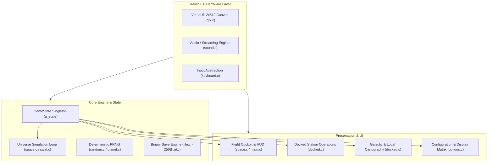
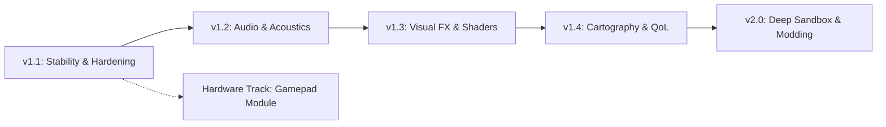
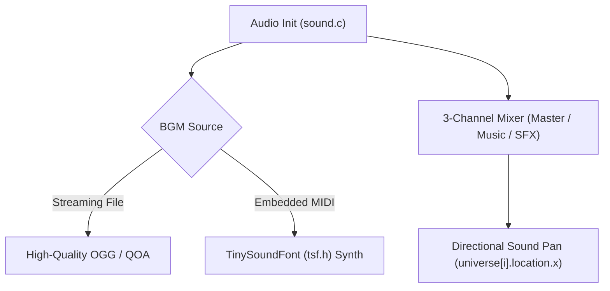
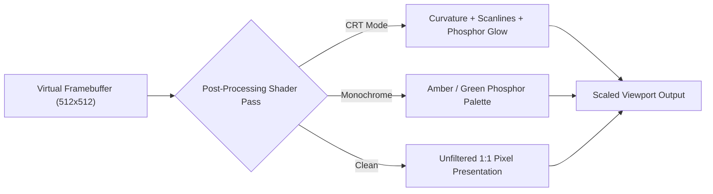
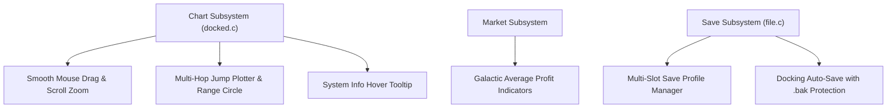
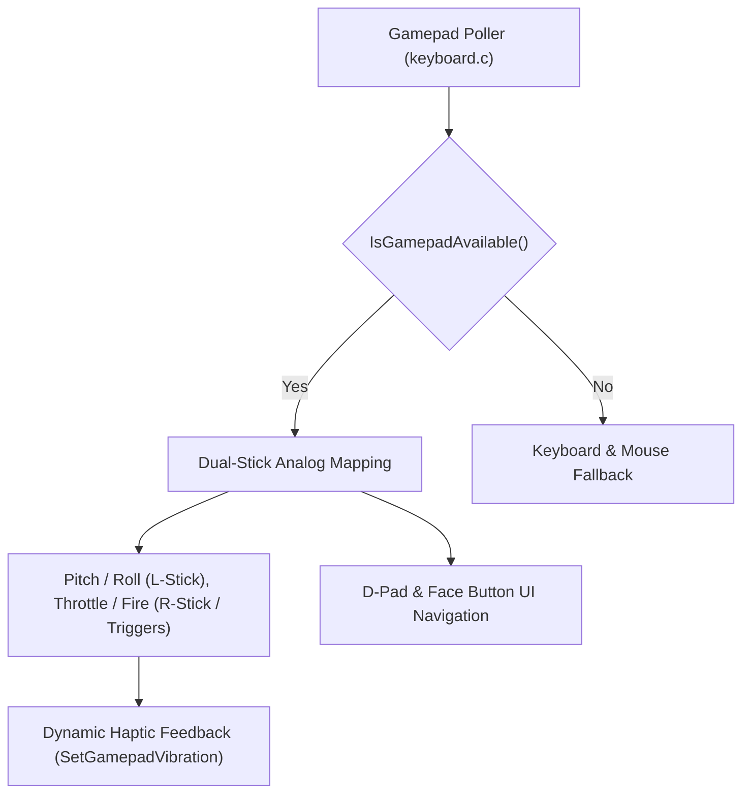

# Elite: The New Kind (Raylib Port) — Engineering Roadmap & Development Plan

## 1. Project Vision & Core Directives

*Elite: The New Kind* is a modern C23 and Raylib 6.0 revival of Christian Pinder’s reverse-engineered PC port of the classic 1984 space trading and combat simulation *Elite*.

The development of this port is governed by two immutable directives:
1. **Mathematical & Mechanical Preservation**: 100% fidelity to the authentic BBC Micro / PC algorithms, procedural Fibonacci universe generation, trade economies, combat AI, and mission triggers.
2. **Modern Ergonomics & Visual Polish**: First-class modern mouse and analog flight controls, modular post-processing CRT shaders, crystal-clear audio synthesis, scalable interfaces, and bulletproof cross-platform reliability.

---

## 2. Architecture Overview & Completed Milestones

### System Architecture Pipeline

### Completed Foundation Milestones
- [x] **Allegro to Raylib Migration**: Complete deprecation of legacy Allegro 4 / DirectX hooks in favor of Raylib 6.0 hardware rendering and audio streaming.
- [x] **ISO C23 Standard Upgrade**: Strict compilation under `-std=c23` with standard `nullptr`, `bool`, `uint32_t`, and `[[nodiscard]]` function attributes.
- [x] **Centralized GameState Singleton**: Consolidated disconnected globals into structured sub-domains ([`ConfigState`](file:///C:/Users/Pedro/coding/clang/newkind/game_state.h#L117-L139), [`PlayerState`](file:///C:/Users/Pedro/coding/clang/newkind/game_state.h#L157-L162), [`FlightState`](file:///C:/Users/Pedro/coding/clang/newkind/game_state.h#L165-L174), [`UniverseState`](file:///C:/Users/Pedro/coding/clang/newkind/game_state.h#L177-L185), [`SessionState`](file:///C:/Users/Pedro/coding/clang/newkind/game_state.h#L188-L194)).
- [x] **Modern Flight Scheme**: Dual-model flight engine (Classic keyboard vs. Modern WASD + direct/virtual-joystick mouse flight with dampening flight assist).
- [x] **Virtual Canvas & Display Pipeline**: 512×512 logical frame rendering with aspect ratio modes (1:1, 4:3, 16:9, Integer, Stretch), window presets (800×600 to 1080p, maximized, fullscreen), and texture filtering options.
- [x] **In-Flight Tactical HUD**: Target lead predictor, target info card, cargo scoop alignment bracket, and status gauges.
- [x] **Docked Interface Improvements**: Docked quick-navigation tab bar, bulk trading shortcuts (Buy Max / Sell All), and instant planet name search.
- [x] **Fast Docking**: Instant docking sequence shortcut (`Shift+D` / `instant_dock`).

---

## 3. Phased Roadmap & Release Strategy

---

### Phase 1: Stability, Event Loop Resilience & Architecture Hardening
**Target Release:** `v1.1` | **Priority:** High | **Status:** Completed

Focus on eliminating blocking event starvation loops, modal lockups, build system idempotency, and finalizing full static variable migration.

#### 1.1 Non-Blocking Mission Event Loop Overhaul
- **Problem**: Mission briefing and debriefing screens in [`missions.c`](file:///C:/Users/Pedro/coding/clang/newkind/missions.c#L224-L328) execute blocking `while (keyasc != ' ')` loops with bare `kbd_read_key()`. This freezes the Raylib message pump, prevents window closing, and produces OS-level "Not Responding" warnings.
- **Affected Functions**: [`constrictor_mission_debrief`](file:///C:/Users/Pedro/coding/clang/newkind/missions.c#L224), [`thargoid_mission_first_brief`](file:///C:/Users/Pedro/coding/clang/newkind/missions.c#L252), [`thargoid_mission_second_brief`](file:///C:/Users/Pedro/coding/clang/newkind/missions.c#L276), [`thargoid_mission_debrief`](file:///C:/Users/Pedro/coding/clang/newkind/missions.c#L303).
- **Implementation**:
  - Convert mission screen presentations into standard frame-based loops executing `gfx_update_screen()`, `kbd_poll_keyboard()`, and checking `WindowShouldClose()`.
  - Provide immediate response to `KEY_SPACE`, `KEY_ENTER`, or mouse clicks.
- **Acceptance Criteria**:
  - Pressing Space advances the screen instantly.
  - Clicking the OS window close button during any mission dialogue cleanly exits without hanging.

#### 1.2 Interactive Modal Prompt Handling
- **Problem**: The error modal in [`main.c`](file:///C:/Users/Pedro/coding/clang/newkind/main.c#L1149-L1157) (`"Error Loading Commander!"`) issues a single `kbd_read_key()` check without an interactive loop, returning immediately before the player can read the message.
- **Affected Functions**: [`load_commander_screen`](file:///C:/Users/Pedro/coding/clang/newkind/main.c#L1136-L1163), file dialog error paths.
- **Implementation**:
  - Implement a modal waiting helper `gfx_display_modal_message(const char *line1, const char *line2)` that pumps events until explicit key/mouse dismissal.
- **Acceptance Criteria**:
  - Load error prompt persists visibly until the user presses Space, Enter, or Escape.

#### 1.3 Build System (Jom) Idempotency & Clean Rebuilds
- **Problem**: Rebuilding or cleaning build artifacts on Windows required a dedicated parallel build driver and reliable deletion scripts.
- **Affected Files**: [`Makefile`](file:///C:/Users/Pedro/coding/clang/newkind/Makefile).
- **Implementation**:
  - Structured `Makefile` with NMake/Jom parallel build directives and explicit per-file dependencies.
  - Native Windows clean commands `cmd /c "del /f /q *.o $(EXEC) 2>nul"` for `jom clean`.
  - Guard `deps\raylib` cloning and static library building.
- **Acceptance Criteria**:
  - `jom`, `jom clean`, and `jom distclean` complete with zero errors.

#### 1.4 Comprehensive GameState Consolidation
- **Problem**: Lingering file-scope static variables remain outside [`GameState`](file:///C:/Users/Pedro/coding/clang/newkind/game_state.h#L197-L204), preventing deterministic save-state serialization and testing.
- **Affected Variables**:
  - [`main.c`](file:///C:/Users/Pedro/coding/clang/newkind/main.c): `cross_timer`, `message_count`, `message_string`, `game_paused`, `find_input`, `have_joystick`.
  - [`docked.c`](file:///C:/Users/Pedro/coding/clang/newkind/docked.c#L80-L82): `cross_x`, `cross_y`, `planet_unknown`.
  - [`planet.c`](file:///C:/Users/Pedro/coding/clang/newkind/planet.c): `rnd_seed`.
- **Implementation**:
  - Add domain structures `UIState` and `CartographyState` to `GameState`.
  - Provide accessor getters `get_ui_state()` and `get_chart_state()`.
- **Acceptance Criteria**:
  - Zero unencapsulated static/global gameplay state variables across `.c` files.

---

### Phase 2: Audio & Music Modernization
**Target Release:** `v1.2` | **Priority:** Medium | **Status:** Planned

Upgrade background music playback, provide persistent multi-channel volume controls, and implement dynamic directional sound feedback.

#### 2.1 BGM Streaming & Soft-Synth Fallback
- **Specification**:
  - Primary: High-fidelity streaming of OGG/QOA audio tracks for *The Elite Theme* and *The Blue Danube*.
  - Secondary / Standalone: Integrate header-only `tsf.h` (TinySoundFont) to synthesize bundled `.mid` tracks directly without OS MIDI dependencies.
  - Auto-fallback to `.wav` or silent grace mode if audio hardware is unavailable.
- **Acceptance Criteria**:
  - Title and docking music stream seamlessly with zero hitching during scene transitions.

#### 2.2 In-Game Volume & Audio Controls
- **Specification**:
  - Add independent sliders for **Master Volume**, **Music Volume**, and **Sound Effects Volume** (0%–100% in 5% steps).
  - Expose controls in [`options.c`](file:///C:/Users/Pedro/coding/clang/newkind/options.c) and persist settings in `newkind.cfg`.
  - Call Raylib `SetMasterVolume()`, `SetMusicVolume()`, and `SetSoundVolume()`.
- **Acceptance Criteria**:
  - Setting volume to 0% mutes channels; values persist accurately across game restarts.

#### 2.3 Spatialized Audio Cues & Immersion SFX
- **Specification**:
  - Calculate stereo pan for weapon impacts and explosions based on relative X coordinate:
    $$\text{pan} = 0.5 + \frac{x_{\text{object}}}{2 \cdot \text{max\_range}}$$
  - Add audio triggers for:
    - Station docking clearance chime.
    - Low fuel audible pulsing warning.
    - Missile lock-on tone modulation.
    - Cargo scoop retrieval sound.
- **Acceptance Criteria**:
  - Left/right laser hits produce audible stereo panning.

---

### Phase 3: Visual FX & Retro Shader Pipeline
**Target Release:** `v1.3` | **Priority:** Medium | **Status:** Planned

Introduce customizable post-processing shaders and dynamic particle visuals while retaining 100% fidelity to the classic wireframe aesthetic.

#### 3.1 Post-Processing Shader Pipeline ([`gfx.c`](file:///C:/Users/Pedro/coding/clang/newkind/gfx.c))
- **Specification**:
  - Render all game graphics into an offscreen `RenderTexture2D` virtual canvas (512×512).
  - Apply custom GLSL post-processing pass during presentation:
    - **CRT Filter**: Multi-tap scanlines, subtle aperture grille mask, barrel distortion, and vignette edge falloff.
    - **Color Schemes**: Authentic Color, Green Phosphor (P1), Amber Phosphor (P4), and Crisp Vector White.
  - Expose shader toggles and intensity presets in [`options.c`](file:///C:/Users/Pedro/coding/clang/newkind/options.c).
- **Acceptance Criteria**:
  - Shader toggles update in real time with negligible performance overhead (>60 FPS on integrated GPUs).

#### 3.2 Hyperspace & Warp Visual Effects ([`stars.c`](file:///C:/Users/Pedro/coding/clang/newkind/stars.c))
- **Specification**:
  - Dynamic 3D star streak acceleration during hyperspace countdown.
  - Witchspace transition tunnel effect with chromatic aberration distortion on Thargoid ambush.
- **Acceptance Criteria**:
  - Hyperspace jump displays smooth star trail stretching into the vanishing point.

#### 3.3 Enhanced Particle & Debris Simulation
- **Specification**:
  - Implement a fast, pre-allocated particle pool ($N=256$) for spark bursts on shield impacts, polygon hull fragmentation on ship destruction, and rock dust on asteroid mining.
- **Acceptance Criteria**:
  - Laser impacts emit directional sparks aligned with the impact normal.

#### 3.4 High-DPI Vector & SDF Font Option
- **Specification**:
  - Add optional high-resolution SDF (Signed Distance Field) font rendering for planetary descriptions and chart labels on 1080p/4K displays.
- **Acceptance Criteria**:
  - Players can toggle between classic 8×8 bitmap font and modern crisp typography.

---

### Phase 4: Cartography, Navigation & Quality of Life (QoL)
**Target Release:** `v1.4` | **Priority:** Medium | **Status:** Planned

Modernize universe exploration, galactic navigation, trading analytics, and save-state workflows.

#### 4.1 Enhanced Galactic & Short-Range Cartography
- **Specification**:
  - **Mouse Drag & Zoom**: Click-and-drag panning on the Galactic and Short-Range Charts with smooth mouse wheel zooming (0.5× to 4.0×).
  - **Jump Range & Route Plotter**: Dynamic reach circle indicating fuel boundaries and visual polyline connecting multi-jump routes.
  - **Hover Tooltips**: Instant hover card displaying tech level, government, economy, and distance without clicking.
- **Acceptance Criteria**:
  - Panning and zooming maintain exact planetary coordinates and cursor alignment.

#### 4.2 Commander Logbook & Progress Journal
- **Specification**:
  - Introduce dedicated Logbook screen (`SCR_LOGBOOK`):
    - Combat kill breakdown by ship class (Sidewinder, Cobra, Thargoid, etc.).
    - Cumulative trading profit ledger and visited systems log.
    - Active mission directives transcript and rumor tracking.
- **Acceptance Criteria**:
  - Statistics update accurately upon combat kills, trading transactions, and hyperspace jumps.

#### 4.3 Market Intelligence & Trade Analytics
- **Specification**:
  - Compare current station prices against galactic average baselines.
  - Color-coded price highlights:
    - **Green**: Buying below average or selling above average (profitable).
    - **Red**: Buying above average or selling below average (unfavorable).
- **Acceptance Criteria**:
  - Market table clearly indicates profitable trade opportunities at a glance.

#### 4.4 Save Management & Multi-Slot System ([`file.c`](file:///C:/Users/Pedro/coding/clang/newkind/file.c))
- **Specification**:
  - Multi-slot save browser in docked options menu displaying Commander Name, Credits, Galaxy, Location, and Timestamp.
  - Auto-save on successful station docking (toggleable in Settings).
  - Automated `.nkc.bak` backup generation to prevent corrupted saves.
- **Acceptance Criteria**:
  - Binary compatibility with original 256-byte `.nkc` format is 100% preserved.

---

### Phase 5: Extended Gameplay & Sandbox Depth
**Target Release:** `v2.0` | **Priority:** Low | **Status:** Future

Expand replayability, contract variety, community modding, and specialized difficulty modes.

#### 5.1 Dynamic Station Bulletin Board
- **Specification**:
  - Procedural secondary missions generated at station bulletin boards:
    - **Bounty Hunting**: Assassinate named pirate commanders in neighboring systems.
    - **Priority Cargo**: High-risk, time-sensitive contraband or medical deliveries.
    - **Distress Rescue**: Salvage escape pods in anarchic systems.
- **Acceptance Criteria**:
  - Completed contracts reward credits and combat rank reputation.

#### 5.2 Deterministic Flight Recorder & Combat Replays
- **Specification**:
  - Record deterministic player inputs and PRNG seeds into lightweight `.nkr` replay files.
  - Provide in-engine playback viewer with free-camera orbit controls.
- **Acceptance Criteria**:
  - Replays reproduce dogfights with 100% mathematical determinism.

#### 5.3 External Ship Data & Modding Architecture
- **Specification**:
  - Externalize ship vertices, face indices, face colors, acceleration, and shield stats to human-readable JSON/text files in `data/ships/`.
- **Acceptance Criteria**:
  - Custom user ships load seamlessly into universe encounter tables.

#### 5.4 Specialized Game Modes
- **Specification**:
  - **Ironman Mode**: Permadeath with automatic single-slot save on dock; game over deletes save file.
  - **Sandbox / Casual Mode**: Configurable starting funds, infinite fuel toggle, and adjustable combat aggression.
- **Acceptance Criteria**:
  - Mode selection on new game start governs save and mechanics rules.

---

### Hardware Track: Gamepad & Controller Integration
**Target Release:** Hardware-Ready Track | **Priority:** Deferred (Hardware Dependent)

- [ ] **Gamepad Detection & Dynamic Hot-Plugging**:
  - Poll `IsGamepadAvailable(0)` and auto-detect controller connects/disconnects.
  - Dynamically switch UI prompt hints between Keyboard (`[SPACE]`) and Gamepad (`(A)`).
- [ ] **Dual-Stick Analog Flight Model**:
  - **Left Stick**: Analog Pitch (with inversion toggle) and Roll/Yaw steering with configurable deadzones.
  - **Right Stick / Triggers**: Analog Throttle control and Primary Laser fire.
  - **Face Buttons & Bumpers**: Missile Lock/Fire, ECM, Hyperspace, Energy Bomb, Fast Docking.
- [ ] **Docked Menu Controller Navigation**:
  - Full D-Pad grid navigation for equipment lists, market prices, and quicknav tabs.
- [ ] **Tactile Rumble & Haptic Feedback**:
  - Trigger `SetGamepadVibration()` on laser discharge, shield hits, missile explosions, and witchspace jumps.

---

## 4. Technical Standards & Coding Guidelines

1. **Standard & Dialect**: Strict ISO C23 (`-std=c23`). Use `nullptr`, standard fixed-width types (`uint32_t`, `int16_t`), `bool`, and `[[nodiscard]]` for all queries and accessors.
2. **State Encapsulation**: Zero raw global field access. All reads/writes must use inline accessors (`get_player_state()`, `get_universe_state()`, `get_config_state()`, `get_flight_state()`, `get_session_state()`).
3. **Graphics Virtualization**: All drawing operations must target the 512×512 coordinate space via `gfx_*` APIs before aspect ratio scaling and shader passes.
4. **Binary Save Compatibility**: The 256-byte binary structure and checksum algorithm (`acc ^ 0xA9`) for `.nkc` files must remain strictly backward and forward compatible with the original game.
5. **Cross-Platform Portability**: Zero platform-specific conditionals in gameplay code; encapsulate all OS specifics in Raylib/C standard libraries.

---

## 5. Risk Assessment & Technical Mitigation Strategies

| Risk Category | Identified Hazard | Impact | Mitigation Strategy |
| :--- | :--- | :--- | :--- |
| **Event Starvation** | Blocking `while` loops in dialogue or modal prompts freezing OS window message pump. | High | Enforce non-blocking frame-based loops with mandatory `gfx_update_screen()` and `WindowShouldClose()` checks. |
| **Save Corruption** | Interrupted write operations damaging the 256-byte `.nkc` commander file. | High | Implement atomic write-rename pattern and automatic `.nkc.bak` backup generation on save. |
| **Shader Incompatibility** | Fragment shader failure across older OpenGL 3.3 / ES / macOS drivers. | Medium | Provide fallback pipeline that cleanly disables post-processing if shader compilation fails. |
| **Audio Thread Hitching** | Disk streaming stalls causing audio stutter during intense combat. | Low | Pre-load core SFX into memory buffers; reserve streaming exclusively for long BGM tracks. |
| **Math Precision Drift** | Floating-point delta rounding errors altering authentic flight physics. | Low | Maintain integer fixed-point mathematics for universe objects; confine floating-point math to flight assist smoothing. |

---

## 6. Milestone Tracking Matrix

| ID | Milestone / Task | Phase | Target Version | Complexity | Status | Verification Tag |
| :--- | :--- | :--- | :--- | :--- | :--- | :--- |
| **1.1** | Non-Blocking Mission Loops | Phase 1 | `v1.1` | Low | **Completed** | `TEST_MISSION_PUMP` |
| **1.2** | Interactive Modal Error Prompt | Phase 1 | `v1.1` | Low | **Completed** | `TEST_MODAL_DISMISS` |
| **1.3** | Makefile Idempotency & Clean Builds | Phase 1 | `v1.1` | Low | **Completed** | `TEST_BUILD_CLEAN` |
| **1.4** | Full GameState Consolidation | Phase 1 | `v1.1` | Medium | **Completed** | `TEST_STATE_ISOLATION` |
| **2.1** | BGM Audio Streaming & Soft-Synth | Phase 2 | `v1.2` | Medium | Planned | `TEST_AUDIO_STREAM` |
| **2.2** | Tri-Channel Volume Controls | Phase 2 | `v1.2` | Low | Planned | `TEST_VOL_PERSIST` |
| **2.3** | Spatial Audio Panning & Immersion SFX | Phase 2 | `v1.2` | Medium | Planned | `TEST_SFX_SPATIAL` |
| **3.1** | CRT Post-Processing Shader Pass | Phase 3 | `v1.3` | High | Planned | `TEST_CRT_PIPELINE` |
| **3.2** | Hyperspace & Witchspace Warp FX | Phase 3 | `v1.3` | Medium | Planned | `TEST_WARP_VISUALS` |
| **3.3** | Dynamic Particle & Spark Pool | Phase 3 | `v1.3` | Medium | Planned | `TEST_PARTICLE_POOL` |
| **3.4** | High-DPI Vector / SDF Font Mode | Phase 3 | `v1.3` | Medium | Planned | `TEST_SDF_FONTS` |
| **4.1** | Chart Mouse Drag, Zoom & Trajectory | Phase 4 | `v1.4` | Medium | Planned | `TEST_CHART_NAV` |
| **4.2** | Commander Logbook & Statistics | Phase 4 | `v1.4` | Medium | Planned | `TEST_CMDR_LOG` |
| **4.3** | Market Profit Margins & Indicators | Phase 4 | `v1.4` | Low | Planned | `TEST_TRADE_INTEL` |
| **4.4** | Multi-Slot Save Browser & Auto-Save | Phase 4 | `v1.4` | Medium | Planned | `TEST_SAVE_SLOTS` |
| **5.1** | Procedural Station Bulletin Board | Phase 5 | `v2.0` | High | Future | `TEST_MISSION_BOARD` |
| **5.2** | Deterministic Flight Recorder | Phase 5 | `v2.0` | High | Future | `TEST_REPLAY_DETERMINISM` |
| **5.3** | External JSON Ship Modding | Phase 5 | `v2.0` | High | Future | `TEST_SHIP_MODS` |
| **5.4** | Ironman & Sandbox Game Modes | Phase 5 | `v2.0` | Medium | Future | `TEST_GAME_MODES` |
| **GP**  | Analog Gamepad & Haptic Feedback | Track | Hardware | High | Deferred | `TEST_GAMEPAD_INPUT` |
